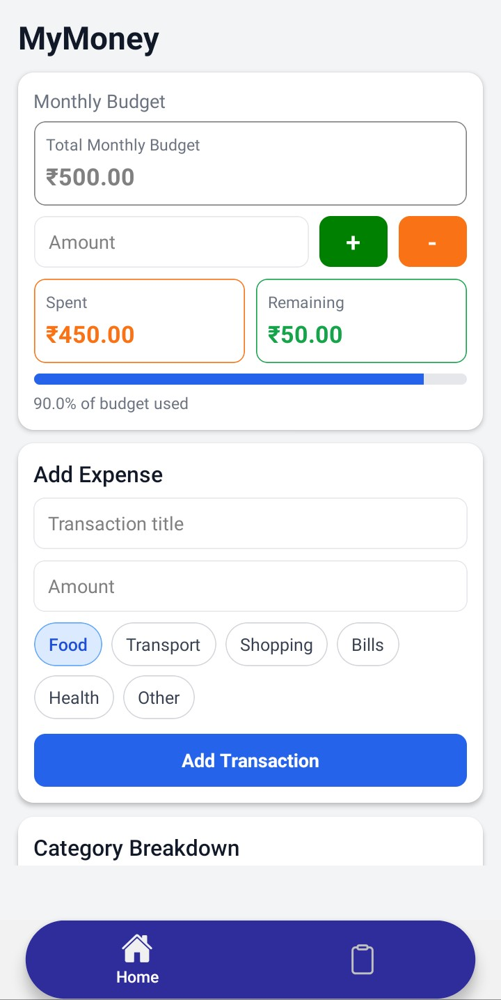
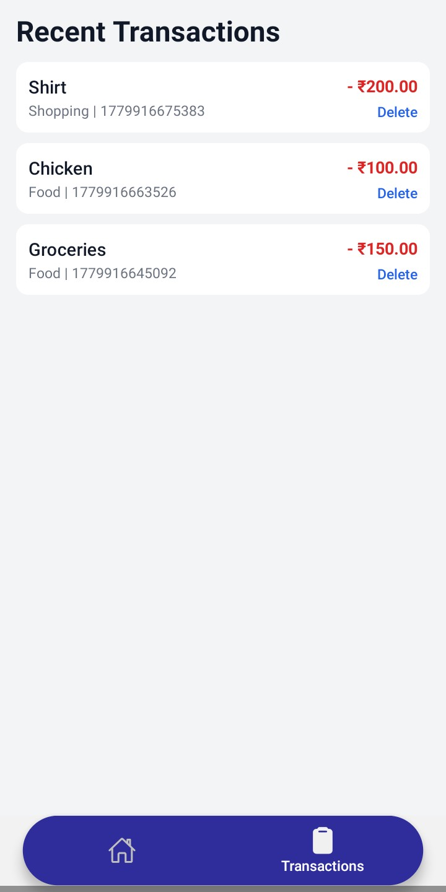

# MyMoneyAI

A modern offline-first personal finance and expense tracking mobile application built using React Native and Expo. The application helps users manage budgets, track expenses, analyze spending patterns, and securely store financial records locally using SQLite.

---

## Features

* Add and manage daily transactions
* Monthly budget tracking
* Category-based expense organization
* Offline-first local storage using SQLite
* Persistent transaction history
* Bottom tab navigation using Expo Router
* Cross-platform support (Android, iOS, Web)
* Real-time expense updates using Context API
* Responsive and modern mobile UI

---

# Highlights

* Built using React Native, Expo Router, and TypeScript
* Implemented offline-first architecture using SQLite
* Designed scalable state management using React Context API
* Integrated persistent local storage for transactions and budgets
* Developed modular tab-based navigation architecture
* Managed asynchronous database operations without blocking UI
* Structured project using reusable components and modular folders

---

# Tech Stack

## Frontend

* React Native
* Expo
* TypeScript
* Expo Router

## Database

* Expo SQLite

## State Management

* React Context API

## Navigation

* Expo Router Tabs

---

# Screenshots

<table>
  <tr>
    <td align="center">
      
      <br />
      Home_Screen
    </td>
    <td align="center">
      
      <br />
      Transactions
    </td>
  </tr>
</table>

---

# Architecture

The application follows a modular and scalable architecture.

```txt
UI Layer
   ↓
Expo Router Navigation Layer
   ↓
React Context State Layer
   ↓
SQLite Persistence Layer
```

### Architecture Overview

* **UI Layer** → React Native components and screens
* **Navigation Layer** → Expo Router tab-based navigation
* **State Layer** → Shared global state using Context API
* **Persistence Layer** → SQLite database for offline storage

---

# Project Structure

```txt
MyMoney/
│
├── app/
│   ├── (tabs)/
│   │   ├── _layout.tsx
│   │   ├── index.tsx
│   │   └── transactions.tsx
│   │
│   └── _layout.tsx
│
├── components/
│   ├── TransactionCard.tsx
│   ├── BudgetCard.tsx
│   └── SummaryBox.tsx
│
├── context/
│   ├── TransactionContext.tsx
│   └── BudgetContext.tsx
│
├── database/
│   └── database.ts
│
├── types/
│   └── transaction.ts
│
├── assets/
│   ├── icons/
│   ├── images/
│   └── screenshots/
│
├── app.json
├── eas.json
├── package.json
└── README.md
```

---

# SQLite Database

The application uses Expo SQLite for persistent offline data storage.

## Transactions Table

| Column    | Type    |
| --------- | ------- |
| id        | INTEGER |
| title     | TEXT    |
| amount    | REAL    |
| category  | TEXT    |
| createdAt | INTEGER |

---

## Budgets Table

| Column    | Type    |
| --------- | ------- |
| id        | INTEGER |
| amount    | REAL    |
| createdAt | INTEGER |

---

# Core Functionalities

## Transaction Management

* Add new transactions
* Delete existing transactions
* Retrieve all transaction history
* Persistent local data storage

---

## Budget Tracking

* Monthly budget calculation
* Remaining balance calculation
* Category-wise expense tracking

---

# Technical Challenges Solved

* Implemented asynchronous SQLite operations without freezing the UI
* Managed shared state across multiple tabs using Context API
* Designed persistent offline-first storage architecture
* Resolved SQLite locking and migration issues
* Integrated Expo Router tab navigation with global state management
* Structured reusable and scalable React Native components

---

# Expo Router Navigation

The application uses Expo Router with tab-based navigation.

```tsx
<Tabs>
  <Tabs.Screen name="index" />
  <Tabs.Screen name="transactions" />
</Tabs>
```

---

# Scalability Plans

Future improvements planned for the application:

* Cloud synchronization
* Authentication system
* AI-powered expense insights
* Expense analytics dashboard
* PDF report export
* Push notifications and reminders
* Dark mode support
* Multi-device synchronization

---

# Demo

APK Download: https://tinyurl.com/bdewwr36

---

# Author

Ansuma Boro

