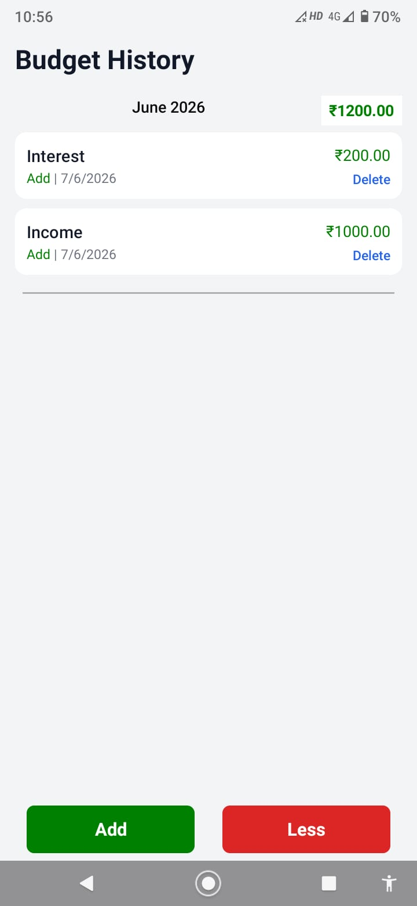

# MyMoney

A modern offline-first personal finance and expense tracking mobile application built using React Native and Expo. The application helps users manage budgets, track expenses, analyze spending patterns, and securely store financial records locally using SQLite.

---

## Features

* View all transactions month-wise
* Add and delete transactions
* Monthly budget tracking with remaining balance calculation
* Add and delete new budget entries
* View all budget entries month-wise
* Category-based expense organization
* Real-time updates using React Context API
* Fully offline-first experience using SQLite
* Persistent transaction history storage
* Clean tab-based navigation using Expo Router
* Responsive and modern mobile UI

---

# Highlights

* Built with React Native, Expo, and TypeScript
* Offline-first architecture using SQLite (expo-sqlite)
* Global state management using Context API
* Modular and reusable component-based structure
* Scalable navigation system using Expo Router Tabs
* Asynchronous database operations without UI blocking
* Clean separation of UI, state, navigation, and persistence layers

---

# Tech Stack

## Frontend

* React Native
* Expo
* TypeScript
* Expo Router

## Database

* Expo SQLite (local offline storage)

## State Management

* React Context API

---

# Screenshots

<table>
  <tr>
    <td align="center">
      
      <br />
      Home_Screen
    </td>
    <td align="center">
      
      <br />
      Transactions
    </td>
    <td align="center">
      
      <br />
      Budgets
    </td>
  </tr>
</table>

---

# Architecture

The application follows a modular and scalable architecture.

```txt
UI Layer (React Native Screens & Components)
        ↓
Navigation Layer (Expo Router Tabs)
        ↓
State Management Layer (React Context API)
        ↓
Persistence Layer (SQLite Database)
```

### Architecture Overview

* **UI Layer** → React Native components and screens
* **Navigation Layer** → Expo Router tab-based navigation
* **State Layer** → Shared global state using Context API
* **Persistence Layer** → Local offline storage using SQLite

---

# Project Structure

```txt
MyMoney/
│
├── app/
│   ├── (tabs)/
│   │   ├── _layout.tsx
│   │   ├── index.tsx
│   │   └── transactions.tsx
│   │
│   ├── _layout.tsx
│   └── budgetHistory.tsx
│
├── components/
│   ├── TransactionCard.tsx
│   ├── BudgetCard.tsx
│   └── SummaryBox.tsx
│
├── context/
│   ├── TransactionContext.tsx
│   └── BudgetContext.tsx
│
├── database/
│   └── database.ts
│
├── types/
│   └── transaction.ts
│
├── assets/
│   ├── icons/
│   ├── images/
│   └── screenshots/
│
├── app.json
├── eas.json
├── package.json
└── README.md
```

---

# SQLite Database

The application uses Expo SQLite for persistent offline data storage.

## Transactions Table

| Column    | Type    |
| --------- | ------- |
| id        | INTEGER |
| title     | TEXT    |
| amount    | REAL    |
| category  | TEXT    |
| createdAt | INTEGER |

---

## Budgets Table

| Column    | Type    |
| --------- | ------- |
| id        | INTEGER |
| title     | TEXT    |
| amount    | REAL    |
| createdAt | INTEGER |

---

# Core Functionalities

## Transaction Management

* Add new transactions
* Delete existing transactions
* View complete transaction history
* Persist data locally using SQLite

---

## Budget Tracking
* Add new budget records
* Delete existing records
* View all budget records
* Monthly budget calculation
* Remaining balance calculation
* Category-wise expense tracking

---

# Technical Challenges Solved

* Implemented asynchronous SQLite operations without freezing the UI
* Managed shared state across multiple tabs using Context API
* Designed persistent offline-first storage architecture
* Resolved SQLite locking and migration issues
* Integrated Expo Router tab navigation with global state management
* Structured reusable and scalable React Native components

---

# Expo Router Navigation

The application uses Expo Router with tab-based navigation.

```tsx
<Tabs>
  <Tabs.Screen name="index" />
  <Tabs.Screen name="transactions" />
</Tabs>
```

---

# Scalability Plans

Future improvements planned for the application:

## Cloud & Sync
* Cloud backup and synchronization
* Multi-device support
## Authentication
* User login and secure data storage
## Analytics
* AI-powered expense insights
* Advanced spending dashboards
## Export & Reports
* PDF report generation
* Monthly financial summaries
## UI Enhancements
* Dark mode support
* Push notifications and reminders

---

# Demo

APK Download (Android): https://tinyurl.com/b8c24phk

---

# Author

Ansuma Boro

